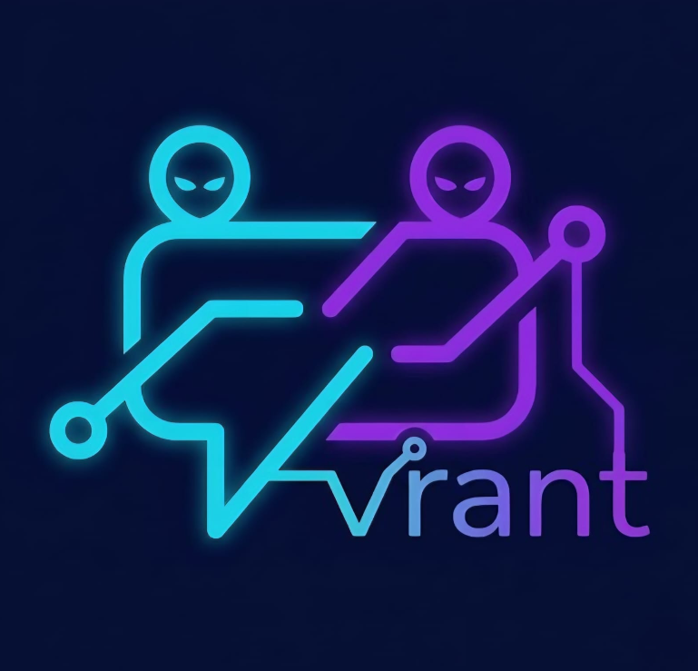

<p align="center">
  
</p>

# VRant

**VRant** is a secure, hybrid peer-to-peer and online messaging application built specifically for the VIT campus community. 
It combines decentralized Bluetooth mesh networking with real-time online features to ensure you stay connected, whether you're in a crowded classroom, at the library, or offline.

## Features

- **VIT Campus Integration**: Specialized features tailored for the VIT community, including Campus Zones, VIT Authentication, and interactive Campus Maps.
- **Hybrid Connectivity**: 
  - **Offline Mesh Network**: Peer-to-peer communication over Bluetooth LE when internet is unavailable.
  - **Online Realtime Mode**: Cloud-synchronized messaging and communities when connected.
- **End-to-End Encryption**: Secure your chats with AES-256-GCM and X25519 key exchange.
- **Communities & Nearby**: Join topic-based groups or discover nearby peers using geohash channels and location awareness.
- **Location & Safety**: Built-in safety managers and location-aware campus zones.
- **Modern UI**: Built entirely with Jetpack Compose and Material Design 3, featuring seamless Light and Dark modes.

## Tech Stack

- **UI**: Jetpack Compose
- **Language**: Kotlin
- **Networking**: Bluetooth LE (Mesh) + REST/WebSockets (Online Realtime)
- **Security**: BouncyCastle (X25519, Ed25519, AES-GCM)
- **Architecture**: MVVM with Coroutines & Flow

## Getting Started

### Prerequisites

- **Android Studio**: Android Studio Giraffe or newer
- **Android SDK**: API level 26 (Android 8.0) or higher
- **Kotlin**: 1.9.0+

### Building the Project

1. Clone the repository:
   ```bash
   git clone https://github.com/MDASARI2028/VRant.git
   cd VRant
   ```

2. Open the project in Android Studio.

3. Sync Gradle and build the app:
   ```bash
   ./gradlew build
   ```

4. Install on a physical device (Bluetooth mesh testing requires physical hardware):
   ```bash
   ./gradlew installDebug
   ```

## Permissions Needed

To function optimally, VRant requires the following permissions:
- **Bluetooth & Nearby Devices**: For creating the offline mesh network.
- **Location**: Required for Bluetooth scanning and Campus Maps/Zones.
- **Internet/Network**: For online realtime chat and communities.
- **Notifications**: To alert you of new messages and alerts.

## Security & Privacy
VRant respects your privacy. Mesh messages are encrypted end-to-end. The application includes a "Wipe" feature to instantly clear all local user data.

## Contributing
Contributions are welcome! Please feel free to submit a Pull Request or open an issue if you have suggestions for new VIT campus features, UI upgrades, or performance improvements.

## License
This project is open-source. See the LICENSE file for details.
